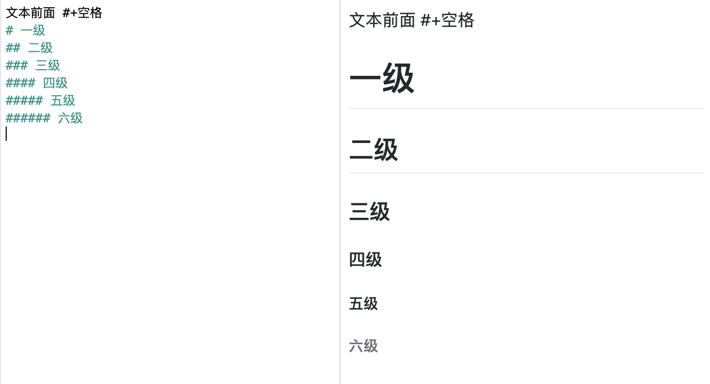
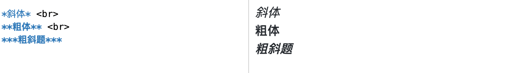

## 1、标题

## 2、列表

## 3、字体
 

## 4、链接
[百度](www.baidu.com "悬停显示: 即在URL之后 用双引号括起来一个字符串。同样要注意这里是英文双引号") &nbsp;&nbsp;&nbsp; \[百度](www.baidu.com "悬停显示: 即在URL之后 用双引号括起来一个字符串。同样要注意这里是英文双引号")

An email <2681568716@qq.com> \<2681568716@qq.com> link.  
