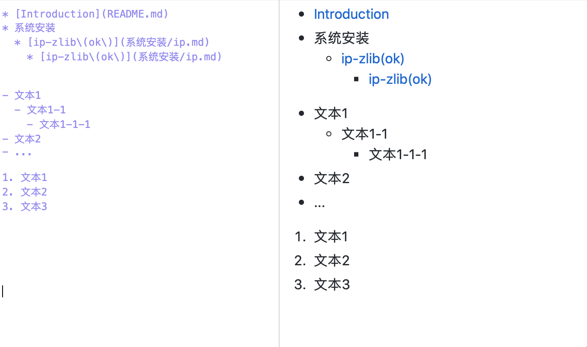

## 1、标题
Markdown 中，你只需要在文本前面加上 #+空格 即可。
# # 一级
## ## 二级
### ### 三级
#### #### 四级
##### ##### 五级
###### ###### 六级 
 

## 2、列表

## 3、字体
 
*斜体* &nbsp;&nbsp;&nbsp;  \*斜体*  
**粗体** &nbsp;&nbsp;&nbsp; \*\*粗体**  
***粗斜题*** &nbsp;&nbsp;&nbsp;  \*\*\*粗斜题***

## 4、链接
[百度](www.baidu.com "悬停显示: 即在URL之后 用双引号括起来一个字符串。同样要注意这里是英文双引号") &nbsp;&nbsp;&nbsp; \[百度](www.baidu.com "悬停显示: 即在URL之后 用双引号括起来一个字符串。同样要注意这里是英文双引号")

An email <2681568716@qq.com> \<2681568716@qq.com> link.  
